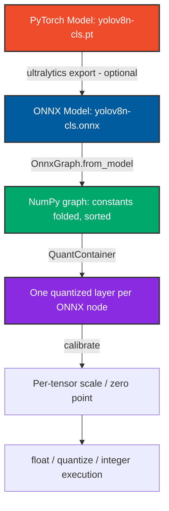
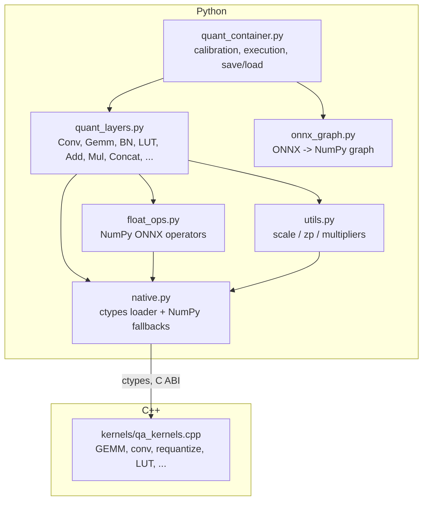
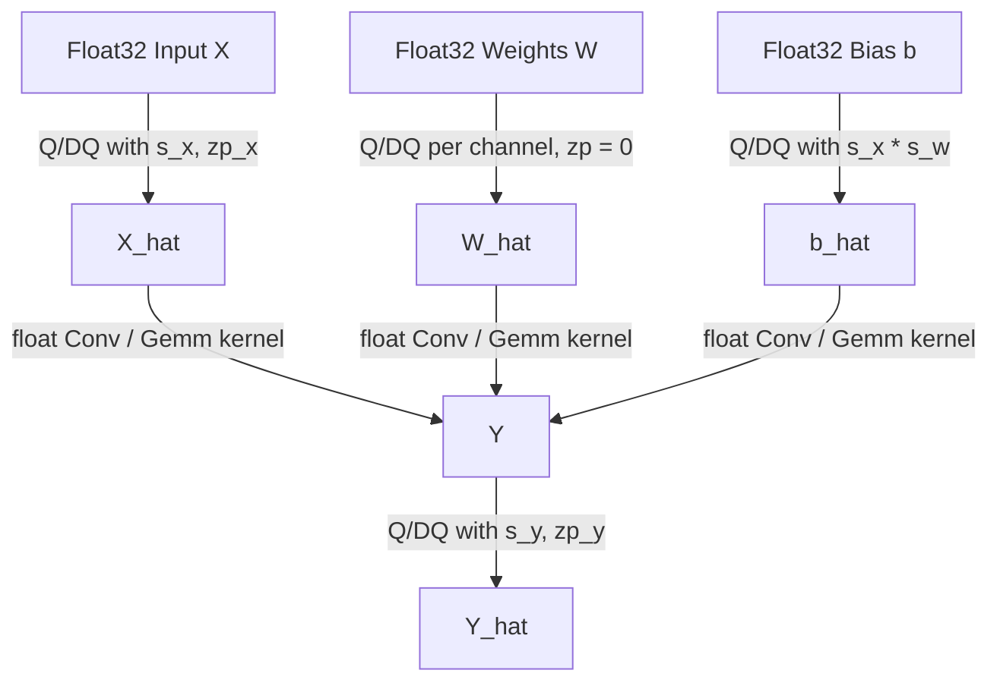
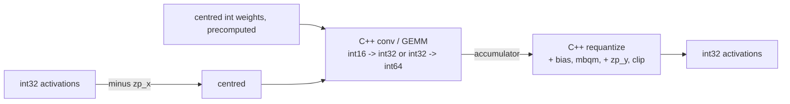

# QuantAnything Architecture

This document describes the post-training static quantization (PTQ)
architecture. The model is an **ONNX** graph, tensors are **NumPy** arrays and
the compute-heavy kernels are written in **C++**. No deep-learning framework
(Keras / TensorFlow / PyTorch) is involved at run time.

---

## 1. Model Flow

The ONNX export is the only place a training framework is needed, and only
once. `download_and_convert.py` does it through the optional `ultralytics`
dependency; any other ONNX file works as well.

---

## 2. Module Layers

* `onnx_graph.OnnxGraph` is the only module touching the ONNX protobuf API.
* `float_ops` implements each supported operator in NumPy. It is the
  reference for calibration, the float baseline, and the "dequantize ->
  float -> quantize" fallback. It is checked against `onnxruntime` in tests.
* `native` loads the C++ library through `ctypes` and falls back to pure
  NumPy when it cannot, with identical results.

---

## 3. QuantContainer: Execution

`QuantContainer` creates one quantized layer per ONNX node
(`map_node_to_quant`) and runs them in topological order, keeping a
`{tensor name -> array}` environment (tensors are released after their last
use):

| Mode | Tensors | Layer method |
| :--- | :--- | :--- |
| `float` | float32 | NumPy reference ops (no calibration needed) |
| `calibrate` | float32 | `calibrate()` records output min / max |
| `quantize` | float32 on the integer grid | `quantized_infer()` (fake quantization) |
| `integer` | int32 holding `[qmin, qmax]` values | `quantized_infer_integer()` |

Quantization parameters are stored **per tensor** in `container.qparams`
(`QParams(scale, zp, qmin, qmax)`):

1. graph inputs: from the min / max observed during calibration,
2. constants used as activations (e.g. `x * const`): from their own range,
3. layer outputs: `finalize_calibration()` publishes them (computed from the
   observed range, or copied from the input for scale-preserving layers).

Consumers simply read their producers' parameters, so scale inheritance needs
no graph back-references. Saving the `qparams` (JSON) together with the ONNX
file fully determines the quantized model.

---

## 4. Simulated (Fake) Quantization Data Path

### Quantization formulas
For any tensor $V$:
- **Quantization**: $q = \text{clip}\left(\text{round}\left(\frac{V}{\text{scale}}\right) + \text{zp},\ q_{min},\ q_{max}\right)$ (round half to even)
- **Dequantization**: $\hat{V} = (q - \text{zp}) \times \text{scale}$
- **Fake quantization**: $\hat{V} = \text{dequantize}(\text{quantize}(V))$

### Calibration schemes
- **Weights**: per output channel (default) or per tensor.
- **Activations**: signed types (`int8`, `int16`, ...) use symmetric ranges
  (`zp = 0`); unsigned types use asymmetric ranges that always contain 0.
- **Biases**: 32-bit (64-bit above 8 activation bits) integers with scale
  $\text{scale}_{input} \times \text{scale}_{weight}$.

---

## 5. Integer-Only Data Path

`mbqm(acc, M0, shift) = round(acc * M0 * 2^-(31+shift))` with
`M0 in [2^30, 2^31)` (negative `M0` is used for negative BatchNorm gammas).
The product is computed in 128-bit arithmetic in C++ and with exact
big-integer fallback in NumPy, so 16-bit models cannot silently overflow.

The accumulator width is chosen per layer by
`native.accumulator_is_wide(bits, K)`: the int16/int32 path is used only if
`(2^bits)^2 * K < 2^31`.

| Layer | Integer implementation |
| :--- | :--- |
| `ConvQuantize` | C++ im2col + GEMM (grouped / depthwise aware), per-channel requantize with bias |
| `GemmQuantize` | C++ GEMM, per-column requantize (`Gemm` with alpha / beta / transB, `MatMul`) |
| `BatchNormalizationQuantize` | per-channel affine through the requantize kernel |
| `ActivationQuantize` | lookup table over the input integer range (<= 16 bits) |
| `AddQuantize` / `MulQuantize` | both operands rescaled to the output grid in one fused kernel |
| `ConcatQuantize` | rescale each input to the output grid, concatenate |
| `GlobalAveragePoolQuantize` | int64 sum, `1/area` folded into the multiplier |
| `ShapingQuantize` | operator applied to the integer tensor, parameters inherited |
| `BaseQuantLayer` | dequantize -> NumPy op -> quantize (e.g. `Softmax`) |

---

## 6. C++ Kernels

`quantization/kernels/qa_kernels.cpp` (C ABI, optional OpenMP):

* `qa_gemm_{f32,i16_i32,i32_i64}`: tiled i-k-j GEMM that the compiler
  auto-vectorizes; tiles are distributed over threads.
* `qa_conv_{f32,i32_i16_i32,i32_i32_i64}`: NCHW convolution, `im2col` + GEMM
  per (image, group), 1x1 stride-1 fast path without `im2col`.
* `qa_requantize_{i32,i64}`: `[outer, C, inner]` per-channel fixed-point
  requantization with pre / post bias, zero point and clipping.
* `qa_rescale`, `qa_add`, `qa_mul`, `qa_lut`: fused element-wise integer
  kernels. `qa_quantize_f32` / `qa_dequantize_f32`: float <-> integer.

Every kernel has a NumPy twin in `native.py`; `tests/test_native.py` and
`tests/test_container.py` assert that both produce identical integers.
