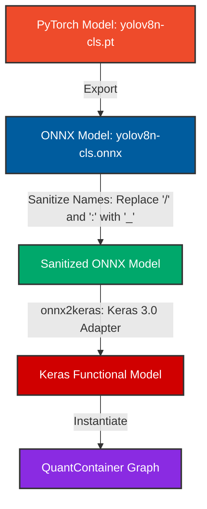
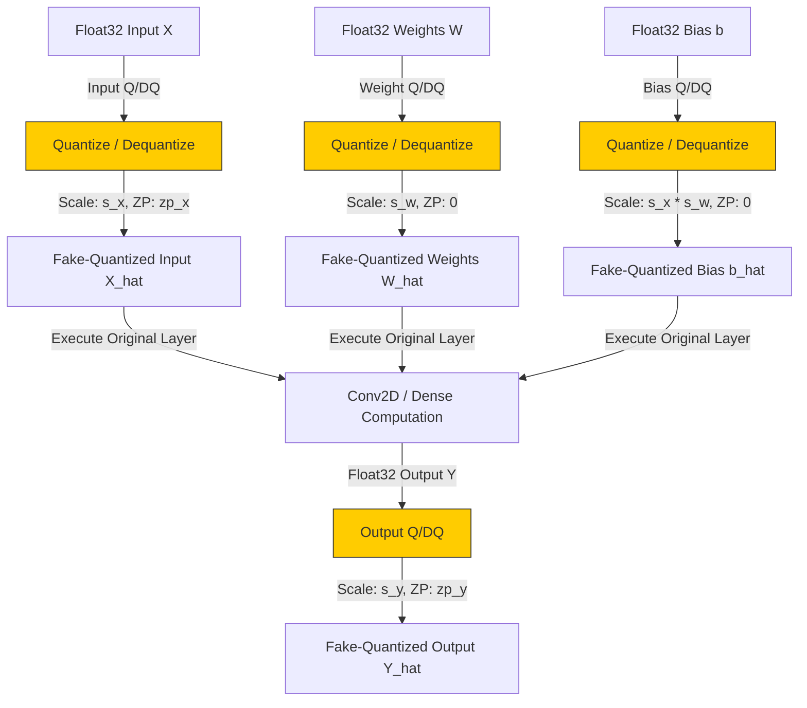

# YOLOv8-cls Manual Quantization Architecture

This document describes the manual quantization architecture implemented for the YOLOv8 nano classification model. The system converts the PyTorch model to Keras 3.0 via ONNX, builds a custom computational graph representation of the model, and performs post-training static quantization (PTQ) layer by layer.

---

## 1. Model Compilation & Conversion Flow

The following diagram illustrates the lifecycle of the model from the initial PyTorch weights down to the custom quantized container:

---

## 2. QuantContainer: Custom Computational Graph

The `QuantContainer` fully controls the calibration and inference workflows by representing the model as a Directed Acyclic Graph (DAG) and running execution in topological order:

```mermaid
graph TB
    subgraph QuantContainer Execution Pass
        A[Input NumPy Array] -->|Feed| B[Input Tensor Cache]
        B -->|Retrieve Inputs| C[Layer 1: InputQuantize]
        C -->|Compute & Store| D[Tensor Cache]
        
        D -->|Retrieve Inputs| E[Layer 2: Conv2DQuantize]
        E -->|Compute & Store| F[Tensor Cache]
        
        D -->|Retrieve Inputs| G[Layer 3: ShapingQuantize split]
        G -->|Compute & Store| H[Tensor Cache]
        
        F & H -->|Retrieve Inputs| I[Layer 4: AddQuantize]
        I -->|Compute & Store| J[Tensor Cache]
        
        J -->|Topological Pass...| K[...]
        K -->|Final Output| L[Model Outputs]
    end

    style B fill:#f9f9f9,stroke:#333,stroke-dasharray: 5 5
    style D fill:#f9f9f9,stroke:#333,stroke-dasharray: 5 5
    style F fill:#f9f9f9,stroke:#333,stroke-dasharray: 5 5
    style H fill:#f9f9f9,stroke:#333,stroke-dasharray: 5 5
    style J fill:#f9f9f9,stroke:#333,stroke-dasharray: 5 5
```

During execution:
1. `QuantContainer` initializes a `tensor_values` cache mapping each original `KerasTensor`'s python ID (`id(tensor)`) to its computed NumPy value.
2. It loops through `model.layers` in order (guaranteed to be topologically sorted).
3. For each layer, it looks up the computed values of the layer's input tensors (`layer.input`) from the cache, runs the quantized layer wrapper, and writes the output back to the cache under the layer's output tensors (`layer.output`).

---

## 3. Simulated (Fake) Quantization Data Path

Each `QuantLayer` (e.g. `Conv2DQuantize`) simulates INT8 quantization effects on the hardware using a Quantize/Dequantize (Q/DQ) pipeline:

### Quantization Formulas
For any tensor $V$ (inputs, weights, outputs):
- **Quantization (Float to Int)**:
  $$q = \text{clip}\left(\text{round}\left(\frac{V}{\text{scale}}\right) + \text{zp},\ q_{min},\ q_{max}\right)$$
- **Dequantization (Int to Float)**:
  $$\hat{V} = (q - \text{zp}) \times \text{scale}$$
- **Fake Quantization**:
  $$\hat{V} = \text{dequantize}(\text{quantize}(V))$$

### Calibration Schemes
- **Weights**: Symmetric signed quantization (zero point is 0). Default is per-channel for convolutional and linear layers.
- **Activations (Inputs/Outputs)**: Asymmetric unsigned/signed quantization based on the specified `quant_type`. Default is signed `int8` (range $[-128, 127]$).
- **Biases**: Quantized to 32-bit integers with a scale factor of $\text{scale}_{input} \times \text{scale}_{weight}$, ensuring they can be added directly to the raw integer products.
